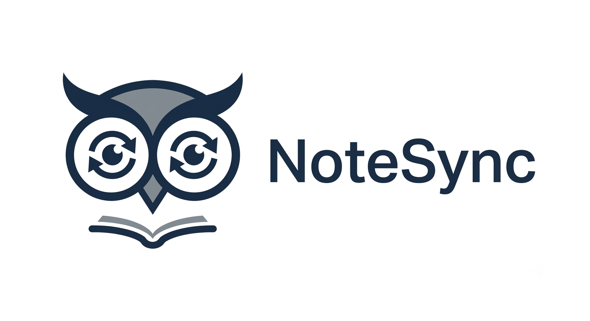

# NoteSync - Notion-Inspired Video Note-Taking & AI Workspace

<p align="center">
  
</p>

<p align="center">
  
  
  
  
  
  
  
  
</p>

---

## Project Overview

**NoteSync** is a professional study workspace designed to transform how video lectures, coding tutorials, and masterclasses are consumed. It integrates a custom video player engine, canvas frame screenshot capture, markdown note-taking, local/remote database synchronization, and Gemini AI-powered learning modules into one responsive, Notion-inspired portal.

---

## Key Features

### Custom Video Player (HTML5 & YouTube) & Playback Sync
- **Hybrid Player Engine**: Plays direct local video files (using browser file blobs) and remote YouTube URLs seamlessly.
- **YouTube API Integration**: Dynamically loads the official YouTube Iframe Player API and binds play/pause, seeks, volume, and playback rates to custom controls.
- **Iframe Origin Control**: Sets explicit `origin` parameter matching `window.location.origin` to satisfy strict security requirements and suppress browser console warnings.
- **Asynchronous Safeguards**: Defensive status checks on YouTube controller references prevent client-side script crashes during slow network loading states.
- **Synchronized Playback**: Playback progress auto-saves to MongoDB per user in the background, allowing you to resume exactly where you left off.
- **Canvas Screenshot Captures**: Instantly captures video frames from HTML5 media elements and links them as visual cards inside markdown notes (gracefully bypassed on YouTube embeds due to cross-origin iframe canvas restrictions).
- **Synchronous Session Blob Validation**: Tracks active files during a session in a global `ACTIVE_SESSION_BLOBS` registry. Prevents browser network connection errors and provides clean user feedback when local file blob URLs expire on page reload.
- **Database Connection Resilience**: Integrates overrides in Zustand sync pipelines to check for `502 Bad Gateway` and invalid content-type payloads, automatically falling back to offline local storage cache if the database server is offline.

### Rich Markdown Notes CRUD
- **Keyboard Shortcuts**: Pressing <kbd>N</kbd> pauses the video, grabs the current time, creates a new note card, and focuses the title editor.
- **Interactive Timestamps**: Click any note timestamp badge or frame screenshot thumbnail to jump the video player to that exact playback second.
- **Rich Text Toolbar**: Quick formatting for bold, italics, code blocks, checklists, and customized Notion color themes.
- **Global Workspace Search**: Instantly filters and searches notes by title, content, or category using multi-field regex indexing.

### Advanced Component Workspace
- **Sticky Notes Drawer (`StickyNotesDrawer`)**: Slide-out scratchpad drawer for drafting temporary session ideas, scratch notes, and loose scribbles.
- **Screenshot Gallery Modal (`ScreenshotGalleryModal`)**: View, download, or review a feed of all frames captured during the study session in a grid layout.

### Gemini AI Suite (Free-tier Fallback included)
- **Executive Summaries**: Distills video note streams into beautiful summaries containing key concepts and action checklists.
- **Interactive Flashcards**: Generates flip-animated study decks based on note highlights.
- **Feynman Concept Explainer**: Input any complicated technical term to get a simple, child-friendly explanation.

### Multi-Format Exports
- **PDF Export**: Generates print-ready PDFs embedding captured frame screenshots.
- **Markdown (`.md`)**: Perfect for importing notes directly into Obsidian or Notion.
- **Plain Text (`.txt`)**: Lightweight lecture summaries.

---

## Project Architecture

```
notesync/
├── client/                     # Vite + React 19 + TypeScript Frontend
│   ├── src/
│   │   ├── components/        # AuthScreen, Header, Sidebar, VideoPlayer, NoteEditor, NoteList, AIModal, ExportModal, ScreenshotGalleryModal, StickyNotesDrawer
│   │   ├── store/             # Zustand store (session tracking & backend API sync)
│   │   ├── types/             # TypeScript interfaces (types/index.ts)
│   │   └── App.tsx            # Auth guards & main workspace layout
├── server/                     # Node.js + Express + Mongoose Backend API
│   ├── config/                # Database connection utilities
│   ├── controllers/           # AI Suite logic (Gemini API & local NLP fallbacks)
│   ├── middleware/            # JWT verification router guards
│   ├── models/                # User, Note, Video, and VideoProgress MongoDB Schemas
│   ├── routes/                # API Endpoints (Auth, Notes, Videos, AI)
│   └── uploads/               # Uploaded video screenshot files directory
└── README.md                   # Comprehensive Workspace Guide
```

---

## Backend API Documentation

All routes (except Auth login/register) require authorization header: `Authorization: Bearer <JWT_TOKEN>`.

### Authentication
- `POST /api/auth/register` - Create user. Request: `{ username, email, password }`
- `POST /api/auth/login` - Authenticate user. Request: `{ email, password }`
- `GET /api/auth/me` - Retrieve authenticated user profile details.
- `PUT /api/auth/preferences` - Sync theme choices: `{ theme: 'light' | 'dark' }`

### Video Workspace
- `GET /api/videos` - Retrieve all videos with current user progress populated.
- `POST /api/videos` - Save a custom video. Request: `{ title, url, duration, thumbnail }`
- `PUT /api/videos/:id/progress` - Save video playback location. Request: `{ currentTime }`

### Timestamped Notes
- `GET /api/notes?videoId=xyz&category=All&q=query` - Read, search, or filter notes.
- `POST /api/notes` - Create note (auto-saves base64 screenshots as files).
- `PUT /api/notes/:id` - Update note details. Request: `{ title, content, category, color, isFavorite }`
- `DELETE /api/notes/:id` - Delete note and its linked physical file.
- `PUT /api/notes/:id/favorite` - Toggle star favorites.

### AI Engine
- `POST /api/ai/summary` - Generate executive summary. Request: `{ notes, videoTitle }`
- `POST /api/ai/flashcards` - Compile flashcards array. Request: `{ notes }`
- `POST /api/ai/explain` - Feynman explainer helper. Request: `{ concept }`

---

## Progress & Git Commit Log

All commit milestones have been successfully implemented, tested, and validated:

| Commit Hash | Commit Message | Highlights |
|---|---|---|
| `67c9c84` | `fix: enable native YouTube controls and origin domain parameter` | Sets native controls and origin parameters in YT Embed to prevent frame errors |
| `6f71f49` | `docs: update README with youtube integration and offline fallback highlights` | Documented YT support, Bad Gateway overrides, and session active blobs |
| `ab79c6a` | `fix: resolve react render cycle race condition on expired local blobs` | Synchronous render-phase checks suppress invalid browser local URL loading logs |
| `f55d3cc` | `fix: safeguard asynchronous youtube API method calls to prevent crash` | Defensive checks verify YT API callbacks exist before triggering player actions |
| `c2f7164` | `fix: handle Bad Gateway 502 responses and add offline fallbacks` | Added content-type checks and local cache fallbacks when backend is offline |
| `ace3ff1` | `fix: resolve unused variable, react-hooks dependency, and unused import warnings` | Cleared 15 compiler and linter warnings from frontend source |
| `ce4d738` | `feat: suppress invalid blob player loading network console errors` | Introduced ACTIVE_SESSION_BLOBS set to track expired blob files |
| `3fdb982` | `feat: improve video error feedback for expired local blobs` | Detects when page is reloaded and guides user to re-select local videos |
| `33ac8d6` | `add youtube video player` | Integrated initial YouTube iframe layout parameters |
| `ed98b83` | `feat: add YouTube video playback support` | Fully integrated YouTube Iframe API and unified player control layout |
| `b9dcde1` | `feat: add crossOrigin and error boundaries to VideoPlayer` | CORS-compliant video tag configuration and custom player error overlays |
| `3568211` | `release: prepare version 1.0.0 portfolio build` | Production client builds, visual optimizations, final cleanup |
| `5e27666` | `docs: write comprehensive README and deployment guide` | Full system architectural mappings and API endpoint references |
| `efb3ebb` | `feat: optimize UI performance and accessibility` | Smooth CSS transitions, dark mode contrast enhancements |
| `f223ae7` | `feat: build global search across notes` | Multi-field regex indexing on notes database |
| `195aa3a` | `feat: generate AI flashcards from notes` | LLM JSON schema review decks and study helpers |
| `483c68d` | `feat: implement AI lecture summaries` | Gemini 1.5 prompt distillation pipelines |
| `4eeb58b` | `feat: add PDF, Markdown and TXT export` | Framer screenshot embedding inside print-ready PDF files |
| `725a878` | `feat: persist video progress and user preferences` | Video progress sync mapping per user inside MongoDB |
| `6e0ef0c` | `feat: integrate frontend with backend APIs` | Zustand state refactoring to sync remote workspace REST payloads |
| `7014a8e` | `feat: build notes CRUD REST API` | Remote note storage schemas and ownership authentication verification |
| `e5b4d1c` | `feat: implement authentication with JWT` | Secured router paths, cryptographically salted passwords, and JWT issue |
| `75c75aa` | `feat: setup Express server and MongoDB connection` | Configured dotenv, Mongoose connectivity, and uploads static directories |
| `bea17cc` | `fix: remove deprecated tsconfig options and update vite config alias path` | Linter cleanups and folder path configurations |
| `84d5e24` | `docs: update README.md with comprehensive badges, architecture, and feature showcase` | Restructured documentation file layout |
| `0841a82` | `docs: consolidate README, note personal use, and outline progress roadmap` | Documented project objectives |
| `a471fe1` | `feat: polish UI with animations and responsive design` | Tailwind transition sets and responsive page wrappers |
| `d0772e6` | `feat: add screenshot bookmarks and timeline navigation` | Video frame canvas capturing integration |
| `ad81263` | `feat: enable note editing, deletion and favorites` | UI card click handlers and mutations |
| `46afdc1` | `feat: create timestamp note panel` | Markdown editor and basic forms integration |
| `a3e5b6d` | `feat: implement custom HTML5 video player` | Standard HTML5 audio and video playback elements configuration |
| `f8acc07` | `feat: build Notion-inspired application shell` | Left-side sidebar navigations and card views |
| `0fbce3a` | `feat: initialize Vite + React + Tailwind + shadcn` | Setup boilerplate structures |
| `2fac651` | `Initial commit` | Base repository files |

---

## Deployment & Startup Guide

### Prerequisites
- **Node.js** (v20.x or higher)
- **MongoDB Server** (Running locally on default port `27017` or remote instance connection URI)

### 1. Server Setup
```bash
# Navigate to the server folder
cd server

# Install backend dependencies
npm install

# Create server/.env configuration file with the following variables:
# PORT=5000
# MONGODB_URI=mongodb://localhost:27017/notesync
# JWT_SECRET=notesync_dev_jwt_secret_token_1298471
# GEMINI_API_KEY=your_gemini_api_key_here
```

Start the backend:
```bash
# Start backend in development mode (with nodemon)
npm run dev
```

### 2. Client Setup
```bash
# Navigate to the client folder
cd client

# Install frontend dependencies
npm install

# Start client development server
# Proxies requests to http://localhost:5000 automatically via vite config
npm run dev
```

### 3. Production Build
```bash
# Compile and build the optimized production static asset bundle
npm run build
```

---

## Keyboard Shortcuts Reference

| Shortcut | Action |
|---|---|
| <kbd>N</kbd> | Grab active playback timestamp, pause the player, and focus note title input |
| <kbd>Ctrl</kbd> + <kbd>K</kbd> / <kbd>Cmd</kbd> + <kbd>K</kbd> | Focus global workspace search input |

---

## Demo

<p align="center">
  <video src="./docs/demo.mp4" controls autoplay loop muted width="100%">
    Your browser does not support the video tag.
  </video>
</p>

---

## License

Personal Portfolio Project. Open for exploration.
